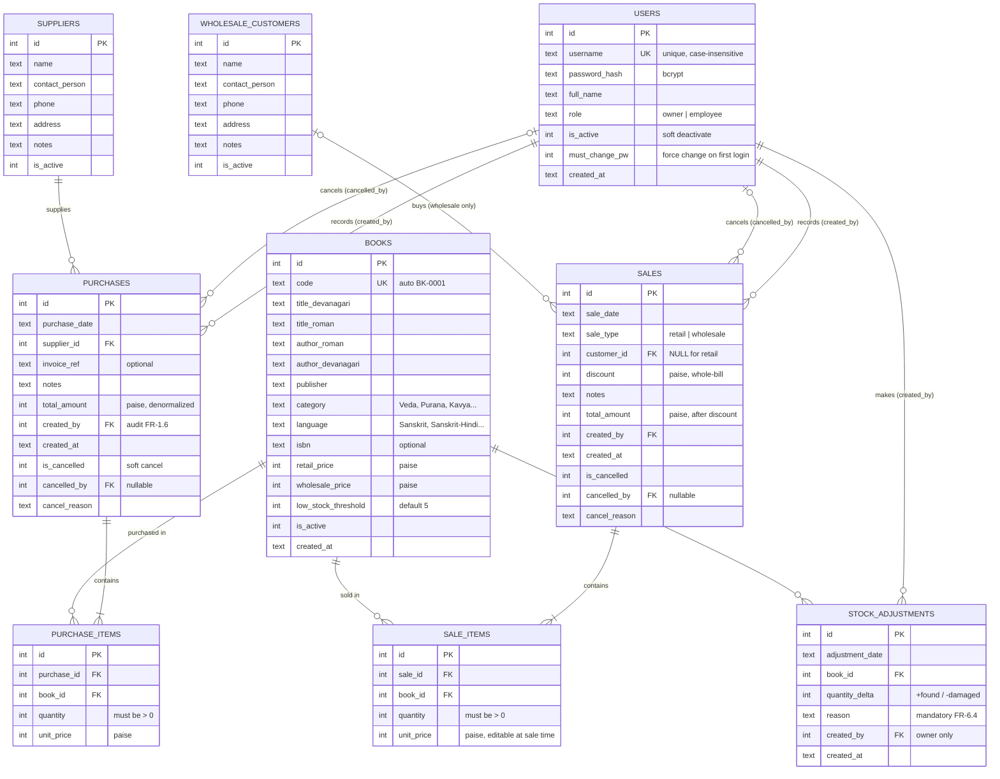

# Entity Relationship Diagram (ERD)

## Shop Management System — "Sanskrit Sahitya Ratnakar"

| | |
|---|---|
| **Document Version** | 1.0 |
| **Date** | 10 June 2026 |
| **Based On** | PRD.md v1.0, TECHNICAL_DESIGN.md v1.0 |

---

## 1. ER Diagram

---

## 2. Relationship Summary

| Relationship | Cardinality | Notes |
|---|---|---|
| USERS → PURCHASES (created_by) | 1 : many | Audit trail (FR-1.6) |
| USERS → SALES (created_by) | 1 : many | Audit trail (FR-1.6) |
| USERS → STOCK_ADJUSTMENTS (created_by) | 1 : many | Owner only (FR-6.4) |
| USERS → PURCHASES / SALES (cancelled_by) | 0..1 : many | Owner-only soft cancellation |
| SUPPLIERS → PURCHASES | 1 : many | Every purchase requires a supplier (FR-3.3) |
| WHOLESALE_CUSTOMERS → SALES | 0..1 : many | Required for wholesale, NULL for retail walk-ins (FR-3.3) |
| PURCHASES → PURCHASE_ITEMS | 1 : 1..many | Header / line-item split |
| SALES → SALE_ITEMS | 1 : 1..many | Header / line-item split |
| BOOKS → PURCHASE_ITEMS | 1 : many | Per-unit cost captured at purchase time |
| BOOKS → SALE_ITEMS | 1 : many | Per-unit price captured at sale time (FR-5.3) |
| BOOKS → STOCK_ADJUSTMENTS | 1 : many | Damage / loss / found / correction |

---

## 3. Key Modeling Notes

- **No stored stock entity**: current stock is derived, never stored —
  `Σ purchase_items.quantity − Σ sale_items.quantity + Σ stock_adjustments.quantity_delta`,
  excluding cancelled transactions (TDD §4, FR-6.1).
- **`SALES.customer_id` is optional**: retail walk-in sales have no customer; a `CHECK`
  constraint enforces that wholesale sales must have one (FR-3.3).
- **Header / line-item split**: `PURCHASES` and `SALES` are transaction headers;
  `PURCHASE_ITEMS` and `SALE_ITEMS` hold one row per book, capturing the per-unit price
  at transaction time. Catalog prices in `BOOKS` are only defaults (FR-5.3).
- **Soft delete / cancel everywhere**: `is_active` flags on users, books, suppliers, and
  customers; `is_cancelled` + `cancelled_by` + `cancel_reason` on purchases and sales —
  history is never destroyed (FR-2.5, FR-4.5, FR-5.8, NFR-7).
- **Audit trail**: every transaction-creating table carries `created_by` → `USERS` and
  `created_at` (FR-1.6, NFR-7).
- **Money as integer paise** in all price/amount columns to avoid floating-point drift;
  converted to rupees only at the UI layer (TDD §5.5).
- **Stock ledger (FR-6.5)** is a computed view that unions purchases, sales, and
  adjustments per book in chronological order — not a stored table.
