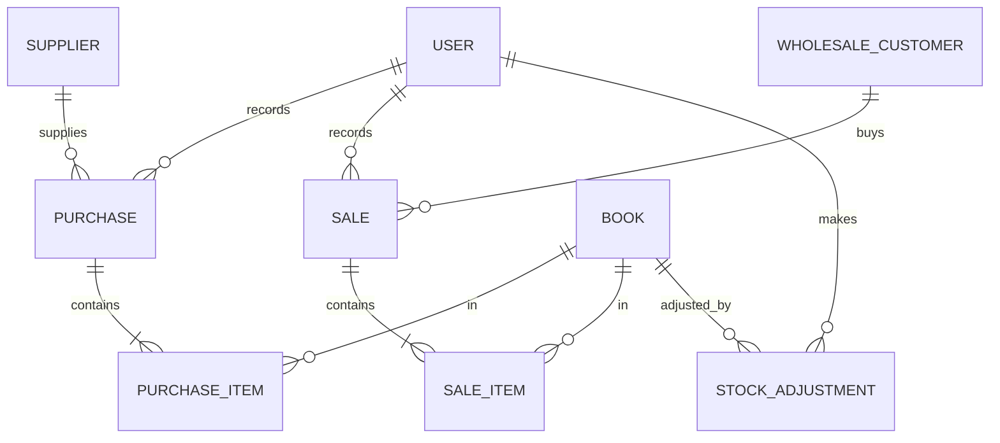
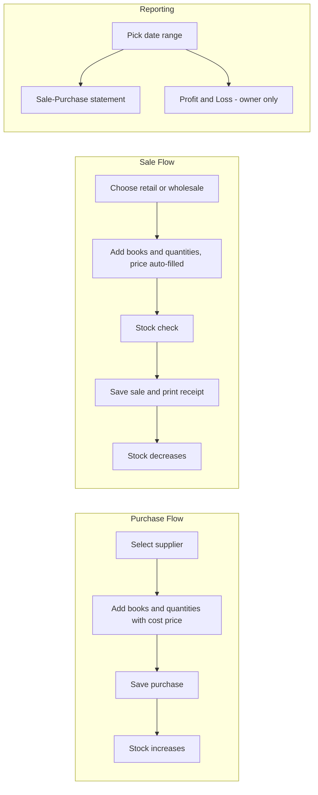

# Project Requirements Document (PRD)

## Shop Management System — "Sanskrit Sahitya Ratnakar"

| | |
|---|---|
| **Document Version** | 1.0 |
| **Date** | 10 June 2026 |
| **Status** | Draft — pending owner approval |
| **Prepared For** | Sanskrit Sahitya Ratnakar (Sanskrit book selling shop) |

---

## 1. Introduction

### 1.1 Purpose
This document defines the functional and non-functional requirements for a Shop Management System for **Sanskrit Sahitya Ratnakar**, a firm specializing in the purchase and sale of Sanskrit books. The system will manage the book catalog (in both Roman and Devanagari scripts), inventory, purchases, sales, and financial reporting.

### 1.2 Scope
The system covers:

- Book catalog management with dual-script (Roman + Devanagari) entries
- Inventory tracking (stock in / stock out / current stock)
- Purchase management (from publishers and wholesalers)
- Sales management (retail counter sales and wholesale sales)
- Financial reporting (Profit & Loss statement, Sale–Purchase statement)
- User management with role-based access (1 Owner, 2 Employees)

Out of scope for version 1.0:

- GST / tax computation and tax-compliant invoicing (simple sale receipts only)
- Online / e-commerce storefront
- Barcode scanning and label printing
- Accounting integrations (Tally, etc.)
- Multi-branch / multi-shop support

### 1.3 Definitions

| Term | Meaning |
|---|---|
| **Devanagari** | The script used to write Sanskrit (e.g., रामायणम्) |
| **Roman / IAST** | Romanized transliteration of Sanskrit (e.g., Rāmāyaṇam) |
| **Supplier** | A publisher or wholesaler from whom the shop purchases books |
| **Retail sale** | Sale to a walk-in customer at the counter |
| **Wholesale sale** | Bulk sale to another wholesaler/reseller, typically at discounted rates |
| **Purchase price** | Per-unit cost at which a book is bought from a supplier |
| **Sale price** | Per-unit price at which a book is sold (retail or wholesale) |

---

## 2. Business Context

- **Business**: Buying Sanskrit books from publishers/wholesalers and selling them to retail customers at the counter or to other wholesalers.
- **Staff**: 1 Owner and 2 Employees (3 system users in total).
- **Key pain points addressed**:
  - No reliable record of current stock per title
  - No consolidated view of purchases vs. sales
  - No quick way to determine profit/loss over a period
  - Book titles must be searchable in both Roman and Devanagari scripts

---

## 3. User Roles and Permissions

### 3.1 Roles

| Role | Count | Description |
|---|---|---|
| **Owner (Admin)** | 1 | Full access to all modules including reports, user management, and price/record corrections |
| **Employee (Staff)** | 2 | Day-to-day operations: catalog entry, recording purchases and sales, viewing stock |

### 3.2 Permission Matrix

| Capability | Owner | Employee |
|---|---|---|
| Login / logout | Yes | Yes |
| Add / edit books in catalog | Yes | Yes |
| Delete books from catalog | Yes | No |
| Record purchases | Yes | Yes |
| Record sales (retail and wholesale) | Yes | Yes |
| Edit / cancel a recorded purchase or sale | Yes | No |
| View current inventory | Yes | Yes |
| Manage suppliers and wholesale customers | Yes | Yes |
| View Profit & Loss statement | Yes | No |
| View Sale–Purchase statement | Yes | Yes (own entries at minimum) |
| Create / deactivate users, reset passwords | Yes | No |
| Adjust stock manually (damage, loss, correction) | Yes | No |

### 3.3 Initial Users
The system shall be seeded with three accounts:

1. **Owner** — role: Owner/Admin
2. **Employee 1** — role: Employee
3. **Employee 2** — role: Employee

Actual names and credentials to be provided by the shop at deployment time; default passwords must be changed on first login.

### 3.4 Adding Users Later
The system is **not limited** to the initial three users. The Owner can add new Employee accounts whenever new staff join, and deactivate accounts when staff leave (see FR-1.3 and FR-1.4). All role permissions in §3.2 apply automatically to newly added users based on their assigned role.

---

## 4. Functional Requirements

### 4.1 Authentication and User Management (FR-1)

- **FR-1.1**: The system shall require login with username and password.
- **FR-1.2**: Passwords shall be stored hashed (never in plain text).
- **FR-1.3**: The Owner shall be able to **add new Employee accounts at any time** (e.g., when a new employee joins the shop) by providing username, full name, role, and an initial password. There shall be no hard limit on the number of employee accounts.
- **FR-1.4**: The Owner shall be able to deactivate an account when an employee leaves and reset passwords for any account. Deactivated users cannot log in, but their past transactions remain intact and attributed to them.
- **FR-1.5**: Newly created users shall be required to change their initial password on first login.
- **FR-1.6**: Every purchase/sale record shall store which user created it (audit trail).

### 4.2 Book Catalog Management (FR-2)

- **FR-2.1**: Each book record shall store, at minimum:
  - Title in **Devanagari** (e.g., रामायणम्)
  - Title in **Roman script** (e.g., Ramayanam / Rāmāyaṇam)
  - Author name (Roman and optionally Devanagari)
  - Publisher
  - Category/genre (e.g., Veda, Purana, Kavya, Vyakarana, Darshana, textbooks)
  - Language details (Sanskrit only, Sanskrit–Hindi, Sanskrit–English, etc.)
  - ISBN (optional — many Sanskrit books lack ISBN)
  - Default retail sale price and default wholesale sale price
  - Internal book code (auto-generated unique ID)
- **FR-2.2**: The system shall fully support Unicode Devanagari input, storage, search, and display.
- **FR-2.3**: Search shall work on either script: typing in Roman or Devanagari shall find the book.
- **FR-2.4**: Duplicate detection: when adding a book, the system shall warn if a book with the same title and publisher already exists.
- **FR-2.5**: Books shall be deactivatable (hidden from sale screens) rather than hard-deleted once they have transaction history.

### 4.3 Supplier and Customer Management (FR-3)

- **FR-3.1**: The system shall maintain a list of **suppliers** (publishers/wholesalers) with name, contact person, phone, address, and notes.
- **FR-3.2**: The system shall maintain a list of **wholesale customers** with the same fields. Retail counter customers do not require registration (walk-in).
- **FR-3.3**: Each purchase must be linked to a supplier; each wholesale sale must be linked to a wholesale customer.

### 4.4 Purchase Management (FR-4)

- **FR-4.1**: Users shall record a purchase containing: date, supplier, one or more line items (book, quantity, per-unit purchase price), and optional invoice/bill reference number and notes.
- **FR-4.2**: Recording a purchase shall automatically **increase** the stock of each book by the purchased quantity.
- **FR-4.3**: The system shall compute and display the purchase total per transaction.
- **FR-4.4**: Purchase history shall be viewable and filterable by date range, supplier, and book.
- **FR-4.5**: Only the Owner may edit or cancel a recorded purchase; doing so shall correctly reverse/adjust stock.

### 4.5 Sales Management (FR-5)

- **FR-5.1**: The system shall support two sale types:
  - **Retail (counter) sale** — walk-in customer, default retail price applies
  - **Wholesale sale** — registered wholesale customer, default wholesale price applies
- **FR-5.2**: A sale shall contain: date, sale type, customer (required for wholesale), one or more line items (book, quantity, per-unit sale price), optional discount, and notes.
- **FR-5.3**: Per-unit price shall default from the catalog (retail or wholesale as applicable) but be editable at the time of sale (e.g., negotiated price).
- **FR-5.4**: Recording a sale shall automatically **decrease** the stock of each book sold.
- **FR-5.5**: The system shall prevent selling more quantity than is currently in stock, with a clear error message.
- **FR-5.6**: The system shall generate a simple **sale receipt** (on screen and printable/exportable) listing items, quantities, prices, discount, and total. No tax computation in v1.0.
- **FR-5.7**: Sales history shall be viewable and filterable by date range, sale type, customer, book, and user.
- **FR-5.8**: Only the Owner may edit or cancel a recorded sale; doing so shall correctly restore stock.

### 4.6 Inventory Management (FR-6)

- **FR-6.1**: The system shall show current stock per book, derived from purchases minus sales plus manual adjustments.
- **FR-6.2**: The inventory view shall display: book code, title (both scripts), publisher, current quantity, last purchase price, and stock value (quantity × last purchase price).
- **FR-6.3**: The system shall support a configurable **low-stock threshold** per book and visually flag books at or below it.
- **FR-6.4**: The Owner shall be able to record manual stock adjustments (damaged, lost, found, correction) with a mandatory reason; adjustments shall appear in the stock ledger.
- **FR-6.5**: A per-book **stock ledger** shall show every movement (purchase, sale, adjustment) in chronological order with running balance.

### 4.7 Reports (FR-7)

- **FR-7.1 Sale–Purchase Statement**: For a user-selected date range, the system shall show:
  - Total purchases (count of transactions, total quantity, total amount)
  - Total sales, split into retail and wholesale (count, quantity, amount)
  - Day-wise / month-wise breakdown
  - Drill-down to individual transactions
- **FR-7.2 Profit & Loss Statement** (Owner only): For a selected date range, the system shall show:
  - Revenue (total sales amount)
  - Cost of Goods Sold (computed from purchase cost of items sold; v1.0 method: **last purchase price** per book, documented and consistent)
  - Gross profit (Revenue − COGS) and gross margin %
  - Profit by sale type (retail vs. wholesale) and top profitable books
- **FR-7.3 Stock Report**: Current stock list with stock valuation totals; low-stock list.
- **FR-7.4**: All reports shall be exportable to CSV/Excel; receipts and statements printable or exportable to PDF.

### 4.8 Dashboard (FR-8)

- **FR-8.1**: On login, users shall see a dashboard with: today's sales total, today's purchases total, low-stock alerts, and recent transactions.
- **FR-8.2**: The Owner's dashboard shall additionally show month-to-date revenue, COGS, and gross profit.

---

## 5. Non-Functional Requirements

| ID | Requirement |
|---|---|
| **NFR-1** | **Unicode support**: Full Devanagari (UTF-8) support across input, storage, search, display, receipts, and exports. |
| **NFR-2** | **Usability**: Simple, form-based UI usable by non-technical staff; common operations (record a sale) completable in under a minute. |
| **NFR-3** | **Performance**: Screens and searches respond within 2 seconds for a catalog of up to 10,000 titles and 100,000 transactions. |
| **NFR-4** | **Reliability**: No transaction may partially apply (e.g., sale recorded but stock not reduced) — all stock-affecting operations must be atomic. |
| **NFR-5** | **Security**: Role-based access control; hashed passwords; no report access for employees beyond their permissions. |
| **NFR-6** | **Backup**: Daily automatic backup of the database; documented restore procedure. |
| **NFR-7** | **Auditability**: Every transaction records who created it and when; edits/cancellations record who changed it and why. |
| **NFR-8** | **Deployment**: Runs on the shop's existing computer(s); accessible to all 3 users (concurrently if on a shared/local network setup). |

---

## 6. Data Model (Conceptual)

Key entities:

- **User**: id, username, password_hash, full_name, role (owner/employee), active
- **Book**: id, code, title_devanagari, title_roman, author, publisher, category, language, isbn, retail_price, wholesale_price, low_stock_threshold, active
- **Supplier**: id, name, contact_person, phone, address, notes
- **WholesaleCustomer**: id, name, contact_person, phone, address, notes
- **Purchase**: id, date, supplier_id, invoice_ref, notes, created_by, total_amount
- **PurchaseItem**: id, purchase_id, book_id, quantity, unit_price
- **Sale**: id, date, type (retail/wholesale), customer_id (nullable for retail), discount, notes, created_by, total_amount
- **SaleItem**: id, sale_id, book_id, quantity, unit_price
- **StockAdjustment**: id, date, book_id, quantity_delta, reason, created_by

Current stock per book = Σ purchase quantities − Σ sale quantities + Σ adjustment deltas.

---

## 7. Key Workflows

---

## 8. Technology Approach

Per the owner's direction, this PRD is **technology-agnostic**; the implementation stack will be decided at design time. The chosen stack must satisfy:

- A relational database (or equivalent) with transactional integrity (NFR-4) and full UTF-8 support (NFR-1)
- A form-based UI suitable for non-technical shop staff (NFR-2)
- Ability to run on the shop's local computer, optionally accessible over the shop's local network (NFR-8)
- CSV/Excel export and printable receipt/report output (FR-7.4)

Candidate stacks to be evaluated during design: a Python-based web app (e.g., Streamlit/Flask + SQLite/PostgreSQL) or a Node.js-based web app (e.g., Express + React + SQLite/PostgreSQL).

---

## 9. Assumptions

1. Single shop location; all data lives in one database.
2. Currency is Indian Rupees (INR); no multi-currency support.
3. Sale receipts are simple (no GST/tax computation) in v1.0.
4. COGS in the P&L uses the last purchase price method in v1.0; FIFO/weighted-average may be considered later.
5. Staff can type Devanagari via standard OS input methods (e.g., Windows Devanagari keyboard / Google Input Tools); the system does not need built-in transliteration in v1.0 (nice-to-have, see §11).
6. Internet connectivity is not required for daily operation.

## 10. Acceptance Criteria (Summary)

The system is accepted for v1.0 when:

1. All three users can log in with their roles enforced per the permission matrix (§3.2).
2. A book can be added with Devanagari and Roman titles and found by searching in either script.
3. Recording a purchase increases stock; recording a sale decreases stock; overselling is blocked.
4. A retail sale and a wholesale sale can each be completed and produce a printable receipt.
5. The Sale–Purchase statement and the Profit & Loss statement produce correct figures for a test dataset over a chosen date range.
6. Inventory view shows correct current stock and flags low-stock books.
7. Reports export to CSV/Excel.
8. The Owner can add a new Employee account, the new employee can log in (with forced first-login password change) and record transactions, and the Owner can later deactivate that account while its transaction history remains intact.

## 11. Future Enhancements (Out of Scope for v1.0)

- GST-compliant invoicing
- Built-in Roman-to-Devanagari transliteration while typing
- Barcode generation/scanning for book codes
- Customer credit/ledger (udhaar) tracking for wholesale customers
- Online catalog / e-commerce integration
- Multi-branch support
- FIFO or weighted-average COGS valuation
