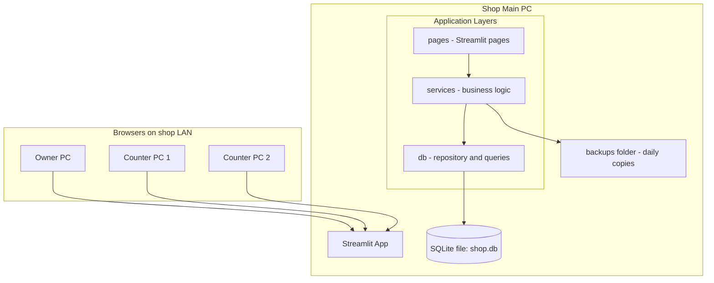

# Technical Design Document (TDD)

## Shop Management System — "Sanskrit Sahitya Ratnakar"

| | |
|---|---|
| **Document Version** | 1.0 |
| **Date** | 10 June 2026 |
| **Based On** | PRD.md v1.0 |
| **Status** | Draft — pending owner approval |

---

## 1. Technology Stack Decision

| Layer | Choice | Rationale |
|---|---|---|
| **Language** | Python 3.11+ | Team expertise; rapid development; excellent Unicode handling |
| **UI Framework** | Streamlit (multipage app) | Form-based UI with minimal code; runs in browser; usable by non-technical staff; serves all 3 users over the shop's LAN from one machine |
| **Database** | SQLite (file-based) | Zero administration; transactional (satisfies NFR-4); full UTF-8 support (NFR-1); single-file backup (NFR-6); more than adequate for 10k titles / 100k transactions (NFR-3) |
| **DB Access** | Python `sqlite3` stdlib + thin repository layer | No ORM overhead; keeps the app simple and dependency-light |
| **Password Hashing** | `bcrypt` | Industry standard (FR-1.2 / NFR-5) |
| **Data handling / exports** | `pandas` + `openpyxl` | DataFrames for report tables; CSV/Excel export (FR-7.4) |
| **PDF receipts/statements** | `reportlab` | Printable receipts and statements with embedded Devanagari font (FR-5.6, FR-7.4) |
| **Devanagari font** | Noto Sans Devanagari (bundled TTF) | Reliable rendering in PDFs across machines |

### Why not the alternatives

- **Node.js + Express + React**: significantly more code and build tooling for the same outcome; no benefit at this scale.
- **PostgreSQL/MySQL**: requires a database server to install, patch, and back up; SQLite gives the same correctness guarantees here with zero ops burden.
- **Gradio**: better suited to ML demos; Streamlit's multipage layout, forms, and `st.dataframe` fit a back-office app better.

### Deployment model

Streamlit runs on the shop's main PC (`streamlit run app.py --server.address 0.0.0.0`). The owner and employees access it via browser at `http://<shop-pc-ip>:8501` from any machine on the shop LAN. No internet required.

---

## 2. Architecture



Three-layer separation:

- **`pages/`** — Streamlit UI only; no SQL. Reads/writes via services.
- **`services/`** — business rules: stock checks, COGS, totals, permission checks, atomic transactions.
- **`db/`** — connection management, schema creation/migration, repository functions returning plain dicts/DataFrames.

---

## 3. Project Structure

```
Proj6-Capstone/
├── app.py                      # Entry point: login gate + navigation
├── pages/
│   ├── 1_Dashboard.py
│   ├── 2_Books.py              # Catalog: list/search/add/edit
│   ├── 3_Purchases.py          # New purchase + purchase history
│   ├── 4_Sales.py              # New sale (retail/wholesale) + history
│   ├── 5_Inventory.py          # Stock view, ledger, adjustments (owner)
│   ├── 6_Reports.py            # Sale-Purchase stmt, P&L (owner), stock report
│   ├── 7_Contacts.py           # Suppliers & wholesale customers
│   └── 8_Users.py              # Owner only: add/deactivate users, reset passwords
├── services/
│   ├── auth_service.py
│   ├── book_service.py
│   ├── purchase_service.py
│   ├── sale_service.py
│   ├── inventory_service.py
│   ├── report_service.py
│   └── contact_service.py
├── db/
│   ├── database.py             # get_connection(), init_db(), seed_initial_users()
│   └── schema.sql
├── utils/
│   ├── receipt_pdf.py          # reportlab receipt/statement generation
│   ├── exports.py              # CSV/Excel helpers
│   └── backup.py               # daily backup-on-first-launch logic
├── assets/
│   └── NotoSansDevanagari-Regular.ttf
├── data/
│   ├── shop.db                 # created at first run (gitignored)
│   └── backups/
├── requirements.txt
└── README.md
```

---

## 4. Database Schema

All text columns are UTF-8 (SQLite default). Foreign keys enforced via `PRAGMA foreign_keys = ON` on every connection. Money stored as `INTEGER` paise (1 INR = 100 paise) to avoid floating-point errors; converted to rupees only at the UI layer.

```sql
CREATE TABLE users (
    id              INTEGER PRIMARY KEY AUTOINCREMENT,
    username        TEXT NOT NULL UNIQUE COLLATE NOCASE,
    password_hash   TEXT NOT NULL,
    full_name       TEXT NOT NULL,
    role            TEXT NOT NULL CHECK (role IN ('owner','employee')),
    is_active       INTEGER NOT NULL DEFAULT 1,
    must_change_pw  INTEGER NOT NULL DEFAULT 1,        -- FR-1.5
    created_at      TEXT NOT NULL DEFAULT (datetime('now'))
);

CREATE TABLE books (
    id                  INTEGER PRIMARY KEY AUTOINCREMENT,
    code                TEXT NOT NULL UNIQUE,           -- auto: BK-0001
    title_devanagari    TEXT NOT NULL,
    title_roman         TEXT NOT NULL,
    author_roman        TEXT,
    author_devanagari   TEXT,
    publisher           TEXT,
    category            TEXT,                           -- Veda/Purana/Kavya/...
    language            TEXT,                           -- Sanskrit / Sanskrit-Hindi / ...
    isbn                TEXT,
    retail_price        INTEGER NOT NULL DEFAULT 0,     -- paise
    wholesale_price     INTEGER NOT NULL DEFAULT 0,     -- paise
    low_stock_threshold INTEGER NOT NULL DEFAULT 5,
    is_active           INTEGER NOT NULL DEFAULT 1,
    created_at          TEXT NOT NULL DEFAULT (datetime('now'))
);
CREATE INDEX idx_books_title_roman ON books(title_roman COLLATE NOCASE);
CREATE INDEX idx_books_title_dev   ON books(title_devanagari);

CREATE TABLE suppliers (
    id             INTEGER PRIMARY KEY AUTOINCREMENT,
    name           TEXT NOT NULL,
    contact_person TEXT, phone TEXT, address TEXT, notes TEXT,
    is_active      INTEGER NOT NULL DEFAULT 1
);

CREATE TABLE wholesale_customers (
    id             INTEGER PRIMARY KEY AUTOINCREMENT,
    name           TEXT NOT NULL,
    contact_person TEXT, phone TEXT, address TEXT, notes TEXT,
    is_active      INTEGER NOT NULL DEFAULT 1
);

CREATE TABLE purchases (
    id           INTEGER PRIMARY KEY AUTOINCREMENT,
    purchase_date TEXT NOT NULL,                        -- YYYY-MM-DD
    supplier_id  INTEGER NOT NULL REFERENCES suppliers(id),
    invoice_ref  TEXT,
    notes        TEXT,
    total_amount INTEGER NOT NULL,                      -- paise, denormalized
    created_by   INTEGER NOT NULL REFERENCES users(id), -- FR-1.6 audit
    created_at   TEXT NOT NULL DEFAULT (datetime('now')),
    is_cancelled INTEGER NOT NULL DEFAULT 0,
    cancelled_by INTEGER REFERENCES users(id),
    cancel_reason TEXT
);

CREATE TABLE purchase_items (
    id          INTEGER PRIMARY KEY AUTOINCREMENT,
    purchase_id INTEGER NOT NULL REFERENCES purchases(id),
    book_id     INTEGER NOT NULL REFERENCES books(id),
    quantity    INTEGER NOT NULL CHECK (quantity > 0),
    unit_price  INTEGER NOT NULL                        -- paise
);
CREATE INDEX idx_pitems_book ON purchase_items(book_id);

CREATE TABLE sales (
    id           INTEGER PRIMARY KEY AUTOINCREMENT,
    sale_date    TEXT NOT NULL,
    sale_type    TEXT NOT NULL CHECK (sale_type IN ('retail','wholesale')),
    customer_id  INTEGER REFERENCES wholesale_customers(id),  -- NULL for retail
    discount     INTEGER NOT NULL DEFAULT 0,            -- paise, whole-bill
    notes        TEXT,
    total_amount INTEGER NOT NULL,                      -- paise, after discount
    created_by   INTEGER NOT NULL REFERENCES users(id),
    created_at   TEXT NOT NULL DEFAULT (datetime('now')),
    is_cancelled INTEGER NOT NULL DEFAULT 0,
    cancelled_by INTEGER REFERENCES users(id),
    cancel_reason TEXT,
    CHECK (sale_type = 'retail' OR customer_id IS NOT NULL)   -- FR-3.3
);

CREATE TABLE sale_items (
    id         INTEGER PRIMARY KEY AUTOINCREMENT,
    sale_id    INTEGER NOT NULL REFERENCES sales(id),
    book_id    INTEGER NOT NULL REFERENCES books(id),
    quantity   INTEGER NOT NULL CHECK (quantity > 0),
    unit_price INTEGER NOT NULL                         -- paise
);
CREATE INDEX idx_sitems_book ON sale_items(book_id);

CREATE TABLE stock_adjustments (
    id             INTEGER PRIMARY KEY AUTOINCREMENT,
    adjustment_date TEXT NOT NULL,
    book_id        INTEGER NOT NULL REFERENCES books(id),
    quantity_delta INTEGER NOT NULL,                    -- +found / -damaged etc.
    reason         TEXT NOT NULL,                       -- FR-6.4 mandatory
    created_by     INTEGER NOT NULL REFERENCES users(id),
    created_at     TEXT NOT NULL DEFAULT (datetime('now'))
);
```

### Current stock (derived, never stored)

```sql
SELECT b.id,
       COALESCE(p.qty,0) - COALESCE(s.qty,0) + COALESCE(a.qty,0) AS stock
FROM books b
LEFT JOIN (SELECT pi.book_id, SUM(pi.quantity) qty
           FROM purchase_items pi JOIN purchases pu ON pu.id = pi.purchase_id
           WHERE pu.is_cancelled = 0 GROUP BY pi.book_id) p ON p.book_id = b.id
LEFT JOIN (SELECT si.book_id, SUM(si.quantity) qty
           FROM sale_items si JOIN sales sa ON sa.id = si.sale_id
           WHERE sa.is_cancelled = 0 GROUP BY si.book_id) s ON s.book_id = b.id
LEFT JOIN (SELECT book_id, SUM(quantity_delta) qty
           FROM stock_adjustments GROUP BY book_id) a ON a.book_id = b.id;
```

Cancellation (owner-only) sets `is_cancelled = 1` rather than deleting — the stock formula automatically excludes cancelled transactions, and history is preserved (NFR-7).

---

## 5. Key Design Decisions

### 5.1 Authentication & sessions
- Login form in `app.py`; on success store `{user_id, username, full_name, role}` in `st.session_state`.
- Every page calls `require_login()` first; owner-only pages call `require_owner()`. Pages 6 (P&L tab) and 8 are owner-gated; cancellation/adjustment actions are owner-gated within shared pages.
- `bcrypt.checkpw` for verification; `must_change_pw = 1` forces a password-change form before any page loads (FR-1.5).
- First run seeds: `owner / employee1 / employee2` with default password `change@123` and `must_change_pw = 1`.

### 5.2 Atomic stock-affecting operations (NFR-4)
Each purchase/sale is written in a single SQLite transaction:

```python
with conn:                       # commits or rolls back atomically
    # 1. re-check stock for every sale line item (inside the transaction)
    # 2. insert sales row
    # 3. insert sale_items rows
```

The stock re-check inside the transaction prevents two simultaneous counter sales from overselling (FR-5.5). SQLite is opened in WAL mode for safe concurrent reads while writing.

### 5.3 Dual-script search (FR-2.3)
A single search box matches against `title_devanagari`, `title_roman`, `author_roman`, `author_devanagari`, and `code` using case-insensitive `LIKE '%term%'`. If the typed text contains Devanagari codepoints (U+0900–U+097F) the Devanagari columns are weighted first in result ordering, else Roman columns. No transliteration engine in v1.0 (PRD §9.5).

### 5.4 COGS / Profit calculation (FR-7.2)
v1.0 uses **last purchase price** per book (PRD §9.4):

- `last_cost(book)` = `unit_price` of the most recent non-cancelled purchase item for that book (0 if never purchased, flagged in the report).
- For each sale line in the date range: `cogs_line = quantity * last_cost(book)`.
- Gross profit = Σ(sale line totals) − whole-bill discounts − Σ(cogs lines).

The method is shown in the report header so figures are never misread as FIFO.

### 5.5 Money representation
All prices stored as integer paise. UI shows ₹ with two decimals; conversion helpers `to_paise(rupees)` / `to_rupees(paise)` live in `utils`. Prevents the classic `0.1 + 0.2` drift in totals (NFR-4 correctness).

### 5.6 Receipts and exports
- **Receipt (FR-5.6)**: `reportlab` A5 PDF — shop name header (Devanagari + Roman), sale id/date/type, line items (Devanagari title + Roman title), discount, grand total, served-by. Offered via `st.download_button`; printable from the browser.
- **Exports (FR-7.4)**: every report table has CSV and Excel download buttons (`pandas.to_csv` / `to_excel`).
- Noto Sans Devanagari TTF registered with reportlab so titles render correctly in PDFs.

### 5.7 Backup (NFR-6)
On app start, `backup.py` checks `data/backups/`; if no backup exists for today, it copies `shop.db` → `backups/shop-YYYY-MM-DD.db` (using `sqlite3` backup API, safe while WAL is active). Keeps the last 30 copies. Restore = stop app, copy a backup file over `shop.db`.

---

## 6. Page-by-Page Functional Mapping

| Page | PRD Requirements | Key UI elements |
|---|---|---|
| Login (`app.py`) | FR-1.1, FR-1.5 | Username/password form; forced password change |
| 1 Dashboard | FR-8.1, FR-8.2 | Today's sale/purchase totals, low-stock alerts, recent transactions; owner extras: MTD revenue/COGS/profit |
| 2 Books | FR-2.1–2.5 | Searchable table; add/edit form with Devanagari + Roman fields; duplicate warning; deactivate (owner) |
| 3 Purchases | FR-4.1–4.5 | Supplier select, multi-line item editor (`st.data_editor`), totals; history with filters; cancel (owner) |
| 4 Sales | FR-5.1–5.8 | Retail/wholesale toggle, customer select, line items with price defaulting + stock display, discount, receipt PDF; history with filters; cancel (owner) |
| 5 Inventory | FR-6.1–6.5 | Stock table with value + low-stock flags; per-book ledger view; manual adjustment form (owner) |
| 6 Reports | FR-7.1–7.4 | Date-range pickers; Sale–Purchase statement with drill-down; P&L tab (owner); stock report; CSV/Excel/PDF buttons |
| 7 Contacts | FR-3.1–3.3 | Tabs for suppliers and wholesale customers; add/edit/deactivate |
| 8 Users | FR-1.3, FR-1.4 | Owner only: list users, add employee, deactivate, reset password |

---

## 7. Dependencies (`requirements.txt`)

```
streamlit>=1.35
pandas>=2.0
bcrypt>=4.0
reportlab>=4.0
openpyxl>=3.1
```

(`sqlite3` ships with Python.)

---

## 8. Implementation Milestones

| # | Milestone | Contents | Acceptance link (PRD §10) |
|---|---|---|---|
| M1 | Foundation | Schema, `init_db`, seeded users, login + forced password change, role gates, Users page | AC-1, AC-8 |
| M2 | Catalog | Books page: add/edit/search both scripts, duplicate warning, deactivate | AC-2 |
| M3 | Contacts + Purchases | Suppliers/customers CRUD; purchase entry with atomic stock increase; purchase history | AC-3 (purchase half) |
| M4 | Sales + Inventory | Sale entry (retail/wholesale), oversell block, receipt PDF; inventory view, ledger, adjustments | AC-3, AC-4, AC-6 |
| M5 | Reports + Dashboard | Sale–Purchase stmt, P&L, stock report, exports; dashboard | AC-5, AC-7 |
| M6 | Polish | Backups, cancellation flows, sample Sanskrit data seed, README, end-to-end acceptance test pass | All |

---

## 9. Risks & Mitigations

| Risk | Mitigation |
|---|---|
| Concurrent writes from 3 browsers on one SQLite file | WAL mode + short transactions + stock re-check inside transaction |
| Devanagari rendering issues in PDFs | Bundle Noto Sans Devanagari TTF; test receipts early (M4) |
| Staff typing Devanagari incorrectly/slowly | Roman title is always searchable; transliteration helper deferred to v2 |
| Accidental data loss | Daily automatic backups, 30-day retention, soft-delete/cancel instead of hard delete |
